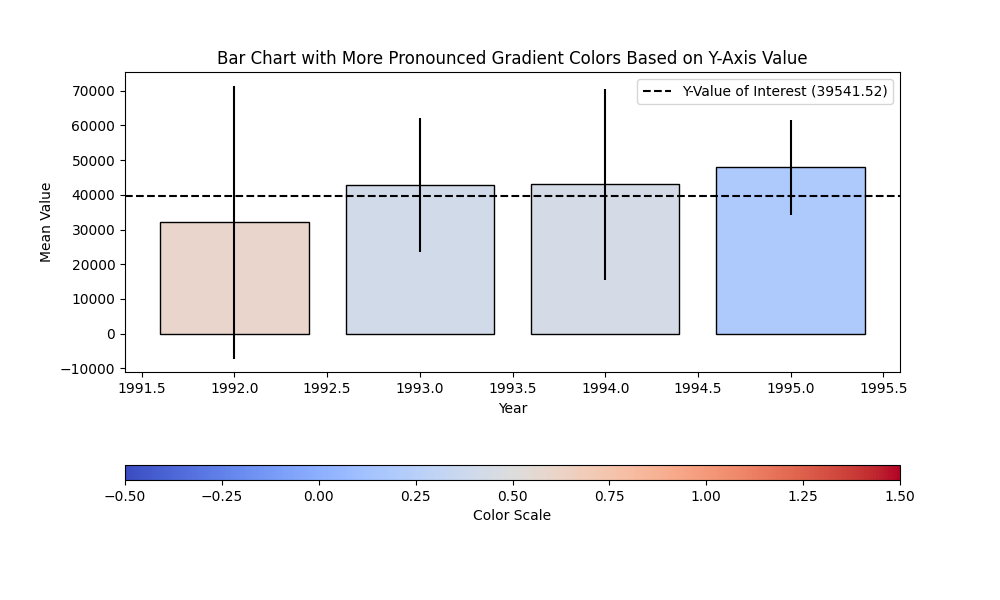

# Customized Bar Chart Visualization
This project showcases a customized bar chart visualization using Python's Matplotlib. It displays mean values for different years with 95% confidence intervals, and uses a color gradient to highlight the relationship of the bars to a reference value (y-value of interest).

## Example Visualization

## Features
- Displays mean values with 95% confidence intervals.
- Uses a custom color gradient based on a reference value (y-value of interest).
- Automatically adjusts colors to show whether values are above or below the reference point.
- Custom annotations and shadow effects for enhanced visualization.

## Dependencies
- Python 3.x
- Matplotlib
- NumPy
- Pandas

## How It Works
This script generates a bar chart with mean values and 95% confidence intervals. Each bar is colored based on how its confidence interval relates to a reference value (y-value of interest). The bars change color from blue to red based on whether the values are below or above the reference point, providing an intuitive visualization of the data.

## References
- Ferreira, N., Fisher, D., & Konig, A. C. (2014). Sample-oriented task-driven visualizations: allowing users to make better, more confident decisions. Proceedings of the SIGCHI Conference on Human Factors in Computing Systems.
